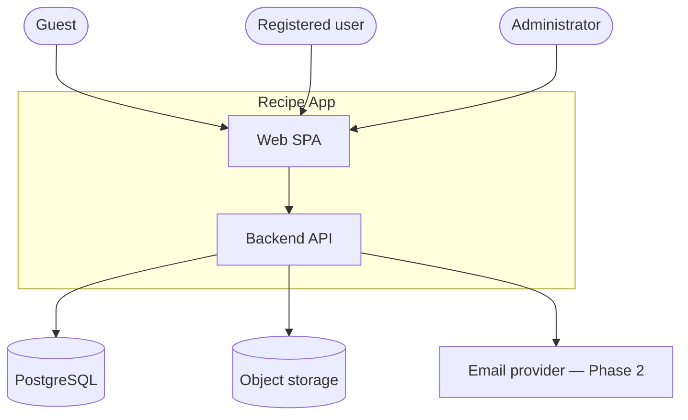
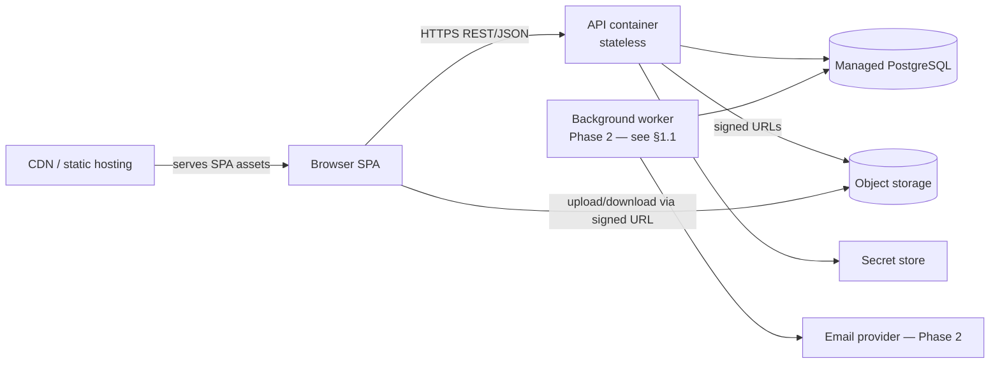
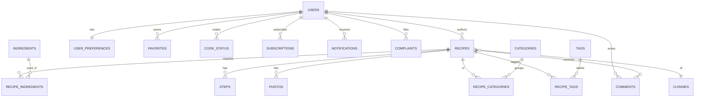
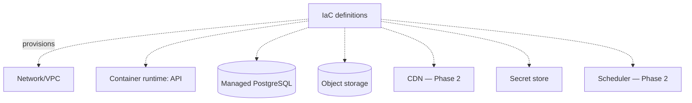

# Architecture

Derived from [`objective.md`](./objective.md). `objective.md` is the fixed source of truth for *what* to build; this document defines *how*. Every component here traces back to a clause in the objective — see the [Traceability matrix](#traceability-matrix).

## 1. Guiding principles

1. **Simplicity over scale.** This is a single product with a bounded, well-understood feature set. A **modular monolith** (one deployable backend) plus a single-page frontend is the default. No microservices, no service mesh, no event-streaming platform until a real need appears.
2. **Cloud-portable building blocks.** The design depends only on capabilities every major cloud offers as a managed service: *run a container*, *managed PostgreSQL*, *object storage*, *CDN*, *secret store*. No proprietary primitive is baked into the application. The provider is finalized as **GCP** (§10); keeping the blocks portable is what makes that choice reversible at low cost.
3. **Stateless application tier.** All durable state lives in PostgreSQL and object storage. The API holds no session state, so it scales horizontally and can scale to zero on serverless container runtimes.
4. **Do the hard features in the database, not in new infrastructure.** "Smart selection" and "recommendations" are implemented with SQL and application logic over PostgreSQL — not a separate search cluster or ML service (§6). This is the single biggest simplification.
5. **Traceability.** Each feature maps to a module, a slice of the data model, and an objective clause.

## 1.1 Phasing

The full design below is the **target**. To stay "simple enough to deploy," **Phase 1** ships the minimum that satisfies every objective requirement; a few non-essential mechanisms are deferred to **Phase 2** behind already-defined seams (no redesign needed).

| Concern | Phase 1 (ship) | Phase 2 (later) |
|---------|----------------|-----------------|
| Notifications | **In-app only**, written synchronously in the request transaction — fully satisfies the objective's notification clauses | Email delivery of those same notifications |
| Background worker | **None — removed** | Reintroduced for email outbox drain + any periodic precompute |
| Statistics | Computed **on-demand** via aggregation queries | Pre-aggregated if query cost grows |
| Recommendations | Computed **on-demand** (§6.3) | Pre-materialized per-user if needed |
| Scheduler / queue | **None** | Cloud Scheduler (+ optional Pub/Sub) for the worker |
| SPA hosting / CDN | Served by the API service | Dedicated CDN + static hosting |

**No objective requirement depends on the worker.** In-app notification rows satisfy the notification clauses; statistics and recommendations run as on-demand queries. The worker is a latency/throughput optimization, not a feature — so Phase 1 omits it and the cloud footprint shrinks accordingly (no scheduler, no queue, no CDN/LB).

## 2. System context



Three actor roles with strictly nested permissions: **Guest ⊂ Registered user ⊂ Administrator** for read scope, with writes gated per role (§8). The same SPA serves all three; the UI reveals capabilities based on the authenticated role.

## 3. Container view (deployable units)



| Unit | Responsibility | Why this shape |
|------|----------------|----------------|
| **Web SPA** | All UI for guest/user/admin. Static assets (HTML/JS/CSS). | Static files → cheapest, most portable hosting (object storage + CDN). |
| **API container** | Stateless REST/JSON backend. All business logic and authorization. | One image, horizontally scalable, runs on any serverless container runtime. |
| **Background worker** *(Phase 2 — not deployed in Phase 1, see §1.1)* | Same image, different entrypoint. Sends queued emails, computes periodic stats, recomputes recommendation inputs. | Keeps request latency low without adding a separate service to build. |
| **Managed PostgreSQL** | All relational state + full-text search + ingredient matching. | One datastore covers transactions, search, and matching. |
| **Object storage** | Recipe and step photos. Uploaded/served directly by the browser via short-lived signed URLs. | Keeps large blobs out of the API path; portable across clouds. |
| **CDN** *(Phase 2)* | Caches SPA assets and public recipe images. | Standard, available everywhere. |

Media never streams through the API: the API issues a signed URL, the browser uploads/downloads directly. This keeps the API tier small and cheap.

## 4. Backend module structure (one process, clear seams)

The backend is a modular monolith. Modules communicate via in-process interfaces, not network calls, but are separated so they *could* be split later.

```
api/
  auth/            registration, login, sessions, role/blocked checks
  users/           profiles, preferences (diets, allergies, disliked ingredients)
  recipes/         CRUD, ingredients, steps, photos, dietary flags, publish workflow
  catalog/         categories, tags, cuisines, basic-ingredients master data
  search/          full-text + faceted filtering
  discovery/       smart selection + personalized recommendations
  social/          favorites, cook-status/history, comments, ratings, subscriptions
  notifications/   in-app feed (Phase 1); email outbox to worker (Phase 2)
  moderation/      submission queue, review/comment moderation, complaints, blocking
  stats/           admin analytics (aggregation queries)
  platform/        shared: storage client, email client, config, authz, db access
```

`platform/` is the only place that touches a cloud SDK (storage, secrets). Everything cloud-specific hides behind interfaces (`BlobStore`, `EmailSender`, `SecretProvider`) so swapping providers stays a localized change — this is what keeps the GCP commitment in §10 low-risk to revisit.

## 5. Data model (PostgreSQL)

Core entities and relationships. Types abbreviated; all tables have `id`, `created_at`, `updated_at`.



Key tables and notable columns:

- **users** — `email`, `password_hash`, `role` (`registered` | `admin`), `status` (`active` | `blocked`), display profile.
- **user_preferences** — `diets` (set of `vegan|vegetarian|gluten_free|lactose_free`), `allergies` (ingredient ids), `disliked_ingredients`. Drives filtering, smart selection, and recommendations alike.
- **recipes** — `author_id`, `title`, `description`, `prep_time_min`, `cook_time_min`, `calories`, `difficulty` (`easy|medium|hard`), `servings`, `cuisine_id`, `status` (`draft` | `pending` | `published` | `hidden`), `search_vector` (`tsvector`, generated), `dietary_flags` (booleans/array: vegan, vegetarian, gluten-free, lactose-free).
- **ingredients** — admin-managed master list; `is_basic` flags pantry staples assumed on-hand for smart selection (this is the objective's "basic ingredients" management).
- **recipe_ingredients** — `recipe_id`, `ingredient_id`, `quantity`, `unit`.
- **steps** — `recipe_id`, `position`, `text`, `photo_url`.
- **photos** — `recipe_id`, `url`, `position`.
- **categories / tags / cuisines** + join tables `recipe_categories`, `recipe_tags` — admin-managed taxonomy.
- **favorites** — `(user_id, recipe_id)`.
- **cook_status** — `(user_id, recipe_id, status ∈ {cooked, want_to_cook}, marked_at)`. Cooking history = rows where `status = cooked` ordered by time.
- **comments** — `recipe_id`, `user_id`, `rating` (1–5, nullable for pure comments), `body`, `status` (`visible` | `hidden`). Recipe rating = aggregate over visible rows.
- **subscriptions** — `(subscriber_id, author_id)`.
- **notifications** — `user_id`, `type`, `payload` (jsonb), `read_at`. Types: new comment/rating on your recipe, new recipe by subscribed author.
- **complaints** — `reporter_id`, `target_type` (`recipe|user|comment`), `target_id`, `reason`, `status` (`open|resolved`).
- **audit fields / soft-delete** — `hidden`/`status` columns rather than hard deletes for recipes and comments, so moderation can hide and admins can restore; statistics remain consistent.

Indexing strategy (keeps search in-DB):
- `GIN` on `recipes.search_vector` for full-text search.
- `GIN` on a denormalized `recipe_ingredients` set / array per recipe for ingredient overlap queries.
- B-tree on filter columns (`prep_time_min`, `calories`, `difficulty`, dietary flags) and FKs.

## 6. Key feature designs

### 6.1 Search & faceted filtering
Full-text query against `recipes.search_vector`; facets (categories, tags, cuisine, prep time, calories, difficulty, dietary flags) become indexed `WHERE` clauses. All in PostgreSQL — no Elasticsearch.

### 6.2 Smart selection (ingredient-based)
Input: a set of ingredient ids the user has on hand. `is_basic` pantry staples are treated as always-available. For each candidate recipe, compute **required ingredients minus (user set ∪ basics)** = missing set. Rank by fewest missing (exact matches first), then by rating. Implemented as a single SQL query using ingredient-set overlap; no extra infrastructure.

### 6.3 Personalized recommendations
**Content-based, deterministic, no ML service.** Build a taste profile from the user's `cooked` + `favorite` recipes: weighted frequencies of their categories, tags, and cuisines. Score unseen `published` recipes by overlap with that profile, **exclude** anything violating the user's diets/allergies, and rank by score then rating. Runs as a query; the Phase 2 worker can pre-materialize per-user candidates on a schedule if needed later. (`pgvector` is a drop-in upgrade path for embedding-based similarity without leaving PostgreSQL.)

### 6.4 Notifications
**Phase 1 — in-app, synchronous, no worker/broker.** On events (comment/rating on your recipe; new recipe by a subscribed author), the API writes notification rows in the same DB transaction as the triggering action. The in-app feed is a simple query. This fully satisfies the objective's notification requirements with zero extra infrastructure.

**Phase 2 — email delivery.** Add a transactional `outbox` table written in the same transaction, drained by the reintroduced worker (§1.1) to send emails. The in-app contract is unchanged; a managed pub/sub queue is an optional later swap behind the same seam.

### 6.5 Media handling
Upload: API validates and returns a signed PUT URL; browser uploads directly to object storage. Serve: public recipe images via CDN; the API stores only the object key/URL.

### 6.6 Sharing
Every published recipe has a stable public URL. Server-rendered Open Graph meta tags (a lightweight SSR endpoint or pre-rendered fragment) make link/social sharing produce rich previews.

## 7. API surface (representative, REST/JSON)

| Area | Endpoints (illustrative) | Min role |
|------|--------------------------|----------|
| Auth | `POST /auth/register`, `POST /auth/login`, `POST /auth/logout` | guest |
| Catalog (read) | `GET /recipes`, `GET /recipes/{id}`, `GET /categories`, `GET /tags`, `GET /cuisines` | guest |
| Search/discovery | `GET /search`, `POST /smart-selection`, `GET /recommendations` | guest / user* |
| Authoring | `POST/PUT/DELETE /recipes`, `POST /recipes/{id}/photos` (signed URL) | registered |
| Social | `POST /recipes/{id}/comments`, `PUT /favorites/{id}`, `PUT /recipes/{id}/cook-status`, `GET /me/history`, `POST /subscriptions` | registered |
| Profile | `GET/PUT /me`, `GET/PUT /me/preferences` | registered |
| Notifications | `GET /me/notifications`, `POST /me/notifications/{id}/read` | registered |
| Moderation | `GET /admin/submissions`, `POST /admin/recipes/{id}/{approve\|hide}`, `GET/POST /admin/complaints`, `POST /admin/comments/{id}/hide` | admin |
| Admin mgmt | `CRUD /admin/{recipes,categories,tags,cuisines,ingredients,users}`, `POST /admin/users/{id}/block` | admin |
| Stats | `GET /admin/stats` | admin |

\* `recommendations` requires login; `smart-selection` and `search` are open to guests.

## 8. Cross-cutting concerns

- **AuthN:** Application-managed email/password with a strong password hash (e.g. argon2/bcrypt). Stateless **JWT** access tokens so the API stays sessionless and horizontally scalable. *(Alternative: GCP Identity Platform / Firebase Auth reduces auth code but couples to the provider; a Phase 2+ option (§10.1). The `auth/` seam allows swapping later.)*
- **AuthZ:** Centralized policy in `platform/authz`. Every request resolves role (`guest` if unauthenticated) and `blocked` status; resource ownership enforced for user-authored content; admin routes namespaced under `/admin`.
- **Moderation/publish workflow:** new user recipes enter `status = pending`; admins approve → `published` or hide. Comments default `visible`, can be moved to `hidden`. Soft-hide everywhere so content is recoverable and stats stay correct.
- **Config & secrets:** 12-factor env vars; secrets pulled from the cloud secret store via `SecretProvider`. No secrets in images or repo.
- **Observability:** structured JSON logs, `/healthz` + `/readyz` probes, request metrics. Managed-runtime logging/metrics are sufficient at this scale.
- **Migrations:** versioned SQL migrations run as a release step before new containers serve traffic.
- **Security baseline:** TLS everywhere (terminated at the edge/runtime), input validation, parameterized queries, signed URLs scoped and short-lived, rate limiting on auth and write endpoints.

## 9. Cloud-agnostic deployment topology

The architecture needs exactly these managed capabilities, each of which has a first-party equivalent on GCP, AWS, and Azure:

| Capability | Role in system |
|------------|----------------|
| Serverless container runtime | Runs the API image (and the Phase 2 worker); scales (incl. to zero). |
| Managed PostgreSQL | Primary datastore, search, matching. |
| Object storage | Recipe/step photos. |
| CDN + static hosting | *(Phase 2)* SPA assets and public images; Phase 1 serves the SPA from the API service. |
| Secret store | DB credentials, JWT signing key, email API key. |
| Managed cron / scheduler | *(Phase 2)* Triggers the worker (outbox drain, periodic precompute). |
| (Optional) managed queue | *(Phase 2)* Only if outbox throughput outgrows DB polling. |

Provisioned via Infrastructure-as-Code (§10). **Phase 1:** networking, the PostgreSQL instance, a storage bucket, the Cloud Run service for the API, secrets, and IAM/service-account wiring. **Phase 2 adds:** the worker service, scheduler, and CDN. Environments (`dev`, `prod`) are the same IaC with different variables. CI builds the container image and the SPA bundle; CD applies IaC and rolls the new image.



---

## 10. Decision: cloud provider & IaC tool (finalized)

**Decision: deploy to GCP, provisioned with Terraform (CLI, run locally — no HashiCorp account).** The architecture above is provider-neutral, so this commits concrete services behind already-defined seams; switching later would be localized, not a redesign. The comparison tables are retained as the record of *why*.

### 10.1 Finalized GCP services

| Building block | GCP service | Phase |
|----------------|-------------|-------|
| Serverless containers (API) | **Cloud Run** | 1 |
| Managed PostgreSQL | **Cloud SQL for PostgreSQL** | 1 |
| Object storage (media) | **Cloud Storage** | 1 |
| Secret store | **Secret Manager** | 1 |
| Container image registry | **Artifact Registry** | 1 |
| SPA hosting | Served by the API's Cloud Run service | 1 |
| CDN + static hosting | **Cloud CDN + HTTPS LB** (or Firebase Hosting) | 2 |
| Scheduler / queue (worker) | **Cloud Scheduler** (+ optional Pub/Sub) | 2 |
| Managed identity (optional) | Identity Platform / Firebase Auth | 2+ |

**Phase 1 footprint is deliberately tiny:** one Cloud Run service, one Cloud SQL instance, one Cloud Storage bucket, Secret Manager, Artifact Registry, and a service account. No load balancer, CDN, scheduler, or Pub/Sub — those arrive only with the Phase 2 worker/CDN (§1.1).

**Why GCP:** Cloud Run is the lowest-friction serverless-container runtime (deploy an image, get autoscaling HTTPS with almost no surrounding config) and pairs cleanly with Cloud SQL and Cloud Storage — the least accidental complexity for a small, stateless workload whose goal is "simple enough to deploy."

### 10.2 Alternatives considered (record)

- **AWS — most ubiquitous** (largest catalog, deepest hiring pool). Not chosen: the equivalent setup needs more wiring (App Runner is simple but less flexible; ECS Fargate needs VPC/ALB/task-defs) — more moving parts for the same result.
- **Azure — best inside a Microsoft estate** (Container Apps ≈ Cloud Run, tight Entra ID). Not chosen absent that org context; Postgres/ecosystem maturity trails the others here.

Full per-provider mapping, for reference:

| Building block | GCP | AWS | Azure |
|----------------|-----|-----|-------|
| Serverless containers | Cloud Run | App Runner / ECS Fargate | Container Apps |
| Managed PostgreSQL | Cloud SQL for PostgreSQL | RDS / Aurora PostgreSQL | Azure Database for PostgreSQL |
| Object storage | Cloud Storage | S3 | Blob Storage |
| CDN + static hosting | Cloud CDN + bucket | CloudFront + S3 | Front Door / CDN + Blob |
| Secret store | Secret Manager | Secrets Manager / SSM | Key Vault |
| Scheduler | Cloud Scheduler | EventBridge Scheduler | Logic Apps / Scheduler |

### 10.3 IaC tool: Terraform — licensing & local-only setup

**Terraform is free and needs no account.** The CLI is free to download and run locally; the paid/account product is *HCP Terraform* (formerly Terraform Cloud), a hosted service for remote state/runs that this project does **not** use.

- **License:** since v1.6 (Aug 2023) Terraform uses the Business Source License (BSL) — free for normal infrastructure use; the BSL only restricts building a competing Terraform-like product. If you want a fully open (MPL-2.0) drop-in, **OpenTofu** is a compatible fork and the same `.tf` files work with either.
- **State backend:**
  - *Phase 1 / local:* default **local state** (`terraform.tfstate` on disk) — zero external dependencies, no account.
  - *Shared / CI:* a **GCS backend** (a Cloud Storage bucket stores the state with versioning + locking) — still just a GCP bucket, no HashiCorp account.
- **Layout & workflow:** one root module composing small per-resource modules (`cloud-run`, `cloud-sql`, `storage`, `secrets`, `iam`), parameterized per environment (`dev`, `prod`); driven by `terraform init / plan / apply` from the CLI or CI.

**Why Terraform over GCP-native** (Config Connector / Deployment Manager): mature plan/apply workflow, huge module/provider ecosystem, and it keeps the (small) option of changing cloud later cheap. A native tool would only be worth it if the team committed hard to GCP *and* needed day-one support for a brand-new GCP feature Terraform's provider lagged on — not the case here.

---

## 11. Non-goals (initial)

Microservices; self-hosted search (Elasticsearch); a dedicated ML/recommendation service; real-time push beyond in-app + email; multi-region/HA topology. Each has a noted upgrade path that does not require redesign.

## 12. Traceability matrix

| Objective requirement | Module(s) | Data | Section |
|-----------------------|-----------|------|---------|
| Guest: browse/view catalog & recipe detail | catalog, recipes | recipes, steps, photos, taxonomy | §3, §5 |
| Guest: search by ingredients/tags/categories | search | search_vector, joins | §6.1 |
| Guest: filter by time/calories/difficulty/diet | search | recipes filter cols, dietary_flags | §6.1 |
| Guest: view ratings & reviews | social | comments | §5 |
| Guest: register / log in | auth | users | §8 |
| User: add/edit/delete own recipes | recipes | recipes, recipe_ingredients, steps, photos | §4, §6.5 |
| User: smart selection | discovery | recipe_ingredients, ingredients.is_basic | §6.2 |
| User: cook status & history | social | cook_status | §5 |
| User: favorites | social | favorites | §5 |
| User: comments & ratings | social | comments | §5 |
| User: personalized recommendations | discovery | cook_status, favorites, preferences | §6.3 |
| User: profile preferences (diets/allergies) | users | user_preferences | §5 |
| User: subscribe to authors + notifications | social, notifications | subscriptions, notifications | §6.4 |
| User: notifications on own recipe activity | notifications | notifications, outbox | §6.4 |
| User: share via links/social | recipes | public URL + OG tags | §6.6 |
| Admin: authentication | auth | users.role | §8 |
| Admin: manage recipes/categories/tags/users | moderation, catalog | all taxonomy + recipes + users | §7 |
| Admin: view profiles / block users | moderation | users.status | §7, §8 |
| Admin: process submission requests | moderation | recipes.status=pending | §8 |
| Admin: moderate reviews/comments | moderation | comments.status | §8 |
| Admin: handle complaints | moderation | complaints | §5, §7 |
| Admin: manage cuisines & basic ingredients | catalog | cuisines, ingredients.is_basic | §5 |
| Admin: view statistics | stats | aggregation queries | §7 |
| Admin: delete/hide recipes & comments | moderation | soft-hide flags | §8 |
