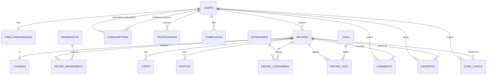

# Data model

Companion to [`architecture.md`](./architecture.md) §5 (data model) and §6 (feature
designs), derived from the fixed [`objective.md`](./objective.md). This document is the
final, implemented PostgreSQL schema for Phase 1.

- **Implementation:** [`api/src/db/schema.ts`](../api/src/db/schema.ts) (Drizzle ORM).
- **Migration:** [`api/drizzle/0000_shiny_white_queen.sql`](../api/drizzle/0000_shiny_white_queen.sql)
  (drizzle-kit output + a hand-written tail for objects Drizzle can't express).
- **Client / migrator / seed:** `api/src/db/{index,migrate,seed}.ts`.
- **Stack:** PostgreSQL 16, Drizzle ORM 0.36, drizzle-kit 0.28, `node-postgres` (`pg`).

Conventions: every table has `id` (`bigserial` PK), `created_at`, `updated_at`
(`timestamptz`, default `now()`). Moderation uses **soft-hide** (status columns),
not hard deletes, for recipes and comments so content is recoverable and stats stay
consistent (architecture §5, §8).

## ER diagram



## Enums

| Enum (`pg_enum`) | Values | Used by |
|------------------|--------|---------|
| `user_role` | `registered`, `admin` | `users.role` |
| `user_status` | `active`, `blocked` | `users.status` (blocking) |
| `recipe_status` | `draft`, `pending`, `published`, `hidden` | `recipes.status` (publish workflow + soft-hide) |
| `recipe_difficulty` | `easy`, `medium`, `hard` | `recipes.difficulty` (filter) |
| `cook_status_kind` | `cooked`, `want_to_cook` | `cook_status.status` |
| `comment_status` | `visible`, `hidden` | `comments.status` (moderation soft-hide) |
| `complaint_target` | `recipe`, `user`, `comment` | `complaints.target_type` |
| `complaint_status` | `open`, `resolved` | `complaints.status` |
| `notification_type` | `new_comment`, `new_rating`, `new_recipe_from_author` | `notifications.type` |

## Tables

All columns below omit the implicit `id`, `created_at`, `updated_at`.

### users
`email` `varchar(320)` (UNIQUE), `password_hash` `text` (argon2), `display_name`
`varchar(120)`, `bio` `text?`, `avatar_url` `text?`, `role` `user_role` = `registered`,
`status` `user_status` = `active`.

### user_preferences  (one row per user)
`user_id` → users (UNIQUE), dietary flags `vegan`/`vegetarian`/`gluten_free`/`lactose_free`
`bool`, `allergies` `bigint[]` (ingredient ids), `disliked_ingredients` `bigint[]`. Drives
filtering, smart selection, and recommendations (architecture §5, §6.3).

### categories / tags / cuisines  (admin taxonomy)
`name` (UNIQUE), `slug` (UNIQUE); categories also have `description?`.

### ingredients  (admin master list)
`name` (UNIQUE), `slug` (UNIQUE), **`is_basic` `bool`** — pantry staples assumed
on-hand for smart selection (the objective's "basic ingredients") (architecture §5, §6.2).

### recipes
`author_id` → users, `title` `varchar(240)`, `slug` (UNIQUE), `description` `text`,
`cuisine_id` → cuisines (`ON DELETE SET NULL`), `status` `recipe_status` = `draft`,
`published_at` `timestamptz?`. **Filter columns:** `prep_time_min`, `cook_time_min`,
`calories`, `servings` (`int`), `difficulty` `recipe_difficulty`. **Dietary flags:**
`vegan`, `vegetarian`, `gluten_free`, `lactose_free` (`bool`). **Derived columns:**
`ingredient_ids` `bigint[]` (denormalized, trigger-maintained — see below) and
`search_vector` `tsvector` (`GENERATED ALWAYS … STORED`).

### recipe_ingredients
`recipe_id` → recipes, `ingredient_id` → ingredients (`ON DELETE RESTRICT`), `quantity`
`varchar(60)?`, `unit` `varchar(40)?`, `position` `smallint`. UNIQUE `(recipe_id, ingredient_id)`.

### steps
`recipe_id` → recipes, `position` `smallint`, `text` `text`, `photo_url` `text?`.
UNIQUE `(recipe_id, position)`.

### photos
`recipe_id` → recipes, `url` `text`, `position` `smallint`.

### recipe_categories / recipe_tags  (M:N joins)
`recipe_id` + `category_id`/`tag_id`; UNIQUE on the pair (cascade delete).

### favorites
`user_id` + `recipe_id`; UNIQUE `(user_id, recipe_id)`.

### cook_status
`user_id` + `recipe_id`, `status` `cook_status_kind`, `marked_at` `timestamptz`.
UNIQUE `(user_id, recipe_id)`. **Cooking history** = rows with `status = cooked` ordered
by `marked_at` (architecture §5).

### comments  (reviews + ratings)
`recipe_id` + `user_id`, `rating` `smallint?` (1–5, **nullable** for pure comments),
`body` `text`, `status` `comment_status` = `visible`. **Recipe rating** = aggregate of
`rating` over `status = visible` rows. CHECK `rating IS NULL OR rating BETWEEN 1 AND 5`.

### subscriptions
`subscriber_id` + `author_id` (both → users); UNIQUE `(subscriber_id, author_id)`;
CHECK `subscriber_id <> author_id` (no self-subscription).

### notifications
`user_id` → users, `type` `notification_type`, `payload` `jsonb` = `'{}'`, `read_at`
`timestamptz?`. In-app feed written synchronously in the triggering transaction (§6.4).

### complaints
`reporter_id` → users, `target_type` `complaint_target`, `target_id` `bigint`
(CHECK `> 0`; polymorphic — no FK, resolved in app by `target_type`), `reason` `text`,
`status` `complaint_status` = `open`.

## Indexes

**Unique:** `users.email`; `(slug)` and `(name)` on categories/tags/cuisines/ingredients;
`recipes.slug`; `user_preferences.user_id`; `recipe_ingredients(recipe_id,ingredient_id)`;
`steps(recipe_id,position)`; the join-table pairs; `favorites(user_id,recipe_id)`;
`cook_status(user_id,recipe_id)`; `subscriptions(subscriber_id,author_id)`.

**B-tree (filters & FKs):** `recipes` on `author_id`, `cuisine_id`, `status`,
`prep_time_min`, `cook_time_min`, `calories`, `difficulty`, and a composite
`(status, published_at)` for the catalog query; FK-side indexes on every join table;
`ingredients.is_basic`; `comments(recipe_id,status)`; `cook_status(user_id,status)`;
`notifications(user_id,created_at)` plus a partial `(user_id) WHERE read_at IS NULL` for
the unread feed; `complaints(status)` and `(target_type,target_id)`; `users.status`.

**GIN (in-DB search & matching):**
- `recipes_search_vector_gin` on `recipes.search_vector` — full-text search.
- `recipes_ingredient_ids_gin` on `recipes.ingredient_ids` — ingredient-set overlap.

## DB-level features

### Full-text search (architecture §6.1)
`recipes.search_vector` is a **generated `tsvector`** column, kept consistent by
PostgreSQL itself (never written by the app):

```sql
search_vector tsvector GENERATED ALWAYS AS (
  setweight(to_tsvector('english', coalesce(title,       '')), 'A') ||
  setweight(to_tsvector('english', coalesce(description, '')), 'B')
) STORED
```

Title is weighted `A`, description `B`, so title hits rank higher. Queries use
`websearch_to_tsquery` against the GIN-indexed column:

```sql
SELECT title, ts_rank(search_vector, websearch_to_tsquery('english', $1)) AS rank
FROM recipes
WHERE search_vector @@ websearch_to_tsquery('english', $1)
ORDER BY rank DESC;
```

drizzle-kit 0.28 **emits the generated column** from the schema definition
(`tsvector(...).generatedAlwaysAs(sql\`...\`)`), but it does **not** emit a GIN index over
a custom column type — so `recipes_search_vector_gin` is created in the hand-written tail
of the migration.

### Smart selection / ingredient matching (architecture §6.2)
Design choice: a **denormalized `recipes.ingredient_ids bigint[]` array with a GIN index**,
rather than ranking by joining `recipe_ingredients` every query. The array stores **only
NON-BASIC** ingredient ids — `is_basic` staples are always-available pantry items and are
excluded from the "missing" computation by construction, so smart selection reads the
array directly.

The array is maintained by triggers (in the migration tail):
- `recipe_ingredients_sync` (AFTER INSERT/UPDATE/DELETE on `recipe_ingredients`) calls
  `refresh_recipe_ingredient_ids(recipe_id)`, which re-aggregates non-basic ingredient ids.
- `ingredients_is_basic_sync` (AFTER UPDATE OF `is_basic` on `ingredients`) refreshes every
  affected recipe when an admin flips a staple's basic/non-basic status.

Ranking query — fewest missing first (exact matches first), then by rating:

```sql
WITH on_hand AS (SELECT $1::bigint[] AS ids)        -- non-basic ids the user has
SELECT r.id, r.title,
       cardinality(ARRAY(SELECT unnest(r.ingredient_ids) EXCEPT SELECT unnest(oh.ids))) AS missing
FROM recipes r CROSS JOIN on_hand oh
WHERE r.status = 'published'
  AND (cardinality(r.ingredient_ids) = 0 OR r.ingredient_ids && oh.ids)  -- GIN-backed prefilter
ORDER BY missing ASC, /* avg visible rating */ DESC;
```

The `&&` (overlap) prefilter is served by `recipes_ingredient_ids_gin`; `@>` (contains)
is also available for "recipes I can make with exactly what I have". B-tree indexes on the
filter columns let diet/time/calorie/difficulty facets be added as cheap `WHERE` clauses
in the same query (§6.1).

### Recommendations (architecture §6.3)
No new schema needed: built on-demand from `cook_status` (cooked) + `favorites` joined to
`recipe_categories`/`recipe_tags`/`cuisine_id`, excluding rows that violate
`user_preferences` diets/allergies. `pgvector` remains a Phase-2 drop-in.

## Deviations from architecture §5

The schema implements §5 fully. Minor, deliberate refinements (none contradict the spec):

1. **Dietary flags as four booleans** (`vegan`, `vegetarian`, `gluten_free`,
   `lactose_free`) on both `recipes` and `user_preferences`, rather than an enum *array*.
   §5 explicitly allowed "booleans/array"; booleans give simple, B-tree-indexable filter
   predicates and an exact column-to-requirement mapping. The objective's four diets are a
   fixed, small set, so no array flexibility is lost.
2. **`recipes.ingredient_ids` stores non-basic ids only.** §5 calls for "a denormalized
   `recipe_ingredients` set/array per recipe for ingredient overlap"; storing only
   non-basic ids folds the "treat `is_basic` as always-available" rule (§6.2) directly into
   the index, so smart selection needs no per-query basics subtraction. Basics remain fully
   represented in `recipe_ingredients` for display (quantities/units).
3. **`complaints.target_id` is polymorphic with no FK** (a CHECK enforces `> 0`); the
   referenced table is chosen by `target_type`. A single FK can't span three tables; this
   matches §5's `target_type`/`target_id` shape.
4. **Added helper columns/constraints** not enumerated but implied: `slug` on recipes and
   taxonomy (stable share URLs, §6.6), `position` ordering on steps/photos/recipe_ingredients,
   `published_at`, a `subscriptions` no-self-subscribe CHECK, and a partial unread-notifications
   index. `notifications.type` is an enum (the three event kinds in §5/§6.4) rather than free text.

All FKs cascade on delete except `recipe_ingredients.ingredient_id` (`RESTRICT`, so an
in-use ingredient can't be deleted out from under a recipe) and `recipes.cuisine_id`
(`SET NULL`).
